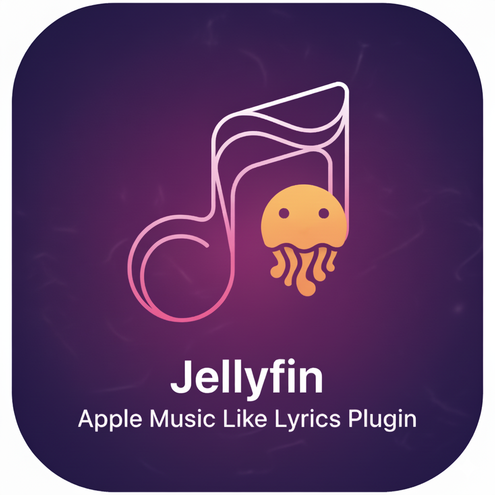
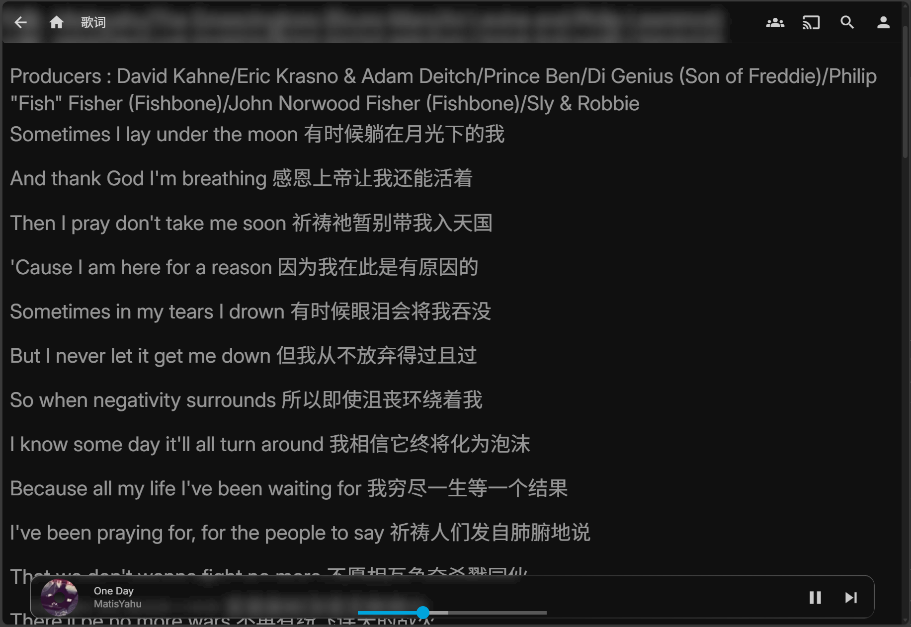
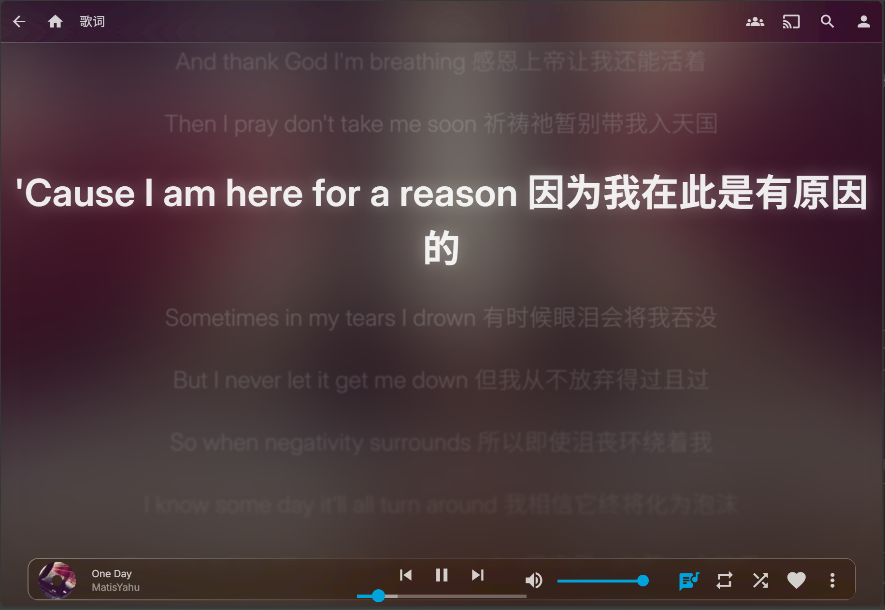
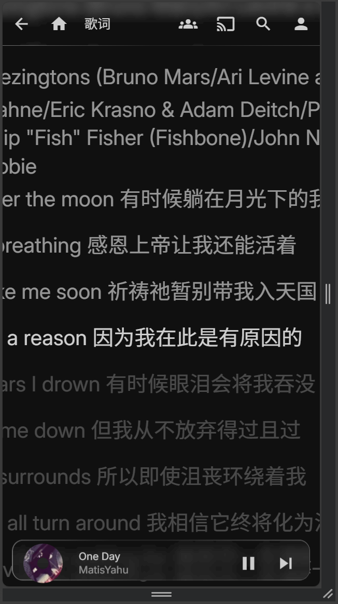
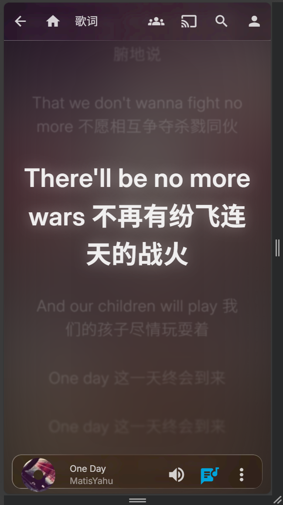

# Jellyfin Apple Music Like Lyrics

<div align="center">



<br/>


[](https://github.com/SnowSwordScholar/JellyfinAppleMusicLikeLyrics/actions/workflows/release.yml)
[](https://github.com/SnowSwordScholar/JellyfinAppleMusicLikeLyrics/actions/workflows/build.yml)

Bring **Apple Music-style lyrics display experience** to Jellyfin web client.

[Installation Guide](#-installation) • [Configuration](#%EF%B8%8F-configuration) • [Troubleshooting](#%EF%B8%8F-troubleshooting) • [Development](#-development)

**English | [简体中文](README_zh.md)**

</div>

---

## Apple Music Style Lyrics
For Jellyfin Server, by injecting index.html and hooking into Jellyfin's original music playback page, provides an Apple Music style lyrics interface. This project depends on [Apple Music Like Lyrics](https://github.com/Steve-xmh/applemusic-like-lyrics), and currently has implemented a relatively elegant hook in the lyrics, and can adjust various animation parameters in detail through WebUI.


<details>
<summary><b>✨ Features</b></summary>

### 🎵 Apple Music Style Lyrics
- **Elegant lyrics rendering**: Smooth scrolling animation, perfect sync with playback progress
- **Responsive font size**: Auto-adapt to landscape/portrait, support custom active/inactive lyrics fonts
- **Gradient blur effect**: Lyrics lines around active lyrics automatically apply gradient blur, highlighting current lyrics
- **Spring animation**: Natural elastic animation transitions with adjustable speed

### 🎨 Dynamic Visual Effects
- **Smart background blur**: Gaussian blur background based on album cover (0-100px adjustable)
- **Customizable transparency**: Independent control of active/inactive lyrics transparency and brightness
- **Glow and shadow**: Active lyrics glow effect with adjustable intensity
- **Color and filters**: Fine control of blur, brightness, shadow and other visual parameters

### ⚙️ Flexible Configuration
- **Web UI configuration**: Easily adjust all parameters through Jellyfin plugin settings page
- **Debug mode**: Optional verbose logging output for troubleshooting
- **Auto lyrics fetch**: Support Jellyfin built-in lyrics system
- **Click to jump**: Click on lyrics line to jump to corresponding time point
</details>

## 📸 Demonstration

Recommend installing theme at the same time: https://github.com/alexyle/jellyfin-theme , so the top and bottom bars will have transparent Gaussian glass effect. In the demonstration below, both sides have this theme installed.

### PC Side Effect Comparison

<table>
<tr>
<td width="50%" align="center"><b>Before (Original)</b></td>
<td width="50%" align="center"><b>After (Apple Music Style)</b></td>
</tr>
<tr>
<td></td>
<td></td>
</tr>
</table>

### Mobile Side Effect Comparison

<table>
<tr>
<td width="50%" align="center"><b>Before (Original)</b></td>
<td width="50%" align="center"><b>After (Apple Music Style)</b></td>
</tr>
<tr>
<td></td>
<td></td>
</tr>
</table>

### Video Demonstration

<details>
<summary><b>🎥 Click to expand video demonstration</b></summary>

<br/>

**PC Side Effect**

https://github.com/user-attachments/assets/aa1fc078-a014-4a06-ac40-e85661d376c5

PC side effect video was compressed, original video is under assets/

**Mobile Side Effect**

[<video src="https://github.com/SnowSwordScholar/JellyfinAppleMusicLikeLyrics/raw/refs/heads/main/assets/MV_moble.mp4" controls width="100%"></video>](https://github.com/user-attachments/assets/fb3e5a35-9de2-4659-88e8-e82c3362e8ce)

</details>

## 🔧 System Requirements

- **Jellyfin**: 10.10.0 or higher
- **Browser**: Chrome 90+, Firefox 88+, Edge 90+, Safari 14+
- **Build Environment** (developers only): .NET 8.0 SDK

## 📦 Installation

### Method 1: Through Jellyfin Plugin Repository (Recommended)


1. Open Jellyfin admin dashboard
2. Navigate to **Dashboard > Plugins > Repositories**
3. Add custom repository:
   - Name: `Apple Music Like Lyrics @SnowSwordScholar`
   - URL: `https://raw.githubusercontent.com/SnowSwordScholar/JellyfinAppleMusicLikeLyrics/main/manifest.json`
4. Go to **Catalog**, search for "Apple Music Lyrics", if it doesn't appear you can open multiple times or restart Jellyfin
5. Click install and restart Jellyfin

### Method 2: Manual Installation

#### 1. Download Plugin

Download the latest `JellyfinAppleLyrics.dll.zip` from [Releases](https://github.com/SnowSwordScholar/JellyfinAppleMusicLikeLyrics/releases) page

#### 2. Install DLL
You can Bing/Google/ask AI here

#### 3. Restart Jellyfin


The plugin will automatically inject necessary scripts when Jellyfin starts. If automatic injection fails, please check the [Troubleshooting](#-troubleshooting) section.

## 🎛️ Configuration

After installation, go to **Jellyfin Dashboard > Plugins > Apple Music Lyrics** for configuration.

### Main Configuration Options

#### Font Settings
| Option | Default | Description |
|------|--------|------|
| Landscape Font Size | 32px | Base font size in desktop/landscape mode |
| Portrait Font Size | 24px | Base font size in mobile/portrait mode |
| Landscape Active Font | 48px | Font size of currently playing lyrics (landscape) |
| Portrait Active Font | 36px | Font size of currently playing lyrics (portrait) |

#### Background Settings
| Option | Default | Description |
|------|--------|------|
| Background Blur | 60px | Blur level of album cover background (0-100) |
| Background Brightness | 0.8 | Background brightness coefficient (0.0-2.0) |

#### Inactive Lyrics Settings
| Option | Default | Description |
|------|--------|------|
| Inactive Brightness | 0.85 | Brightness of inactive lyrics (0.0-2.0) |
| Inactive Opacity | 0.65 | Opacity of inactive lyrics (0.0-1.0) |
| Inactive Blur | 0.5px | Blur level of inactive lyrics (0-10) |
| Inactive Shadow | 0.0 | Shadow intensity of inactive lyrics (0.0-1.0) |

#### Active Lyrics Settings
| Option | Default | Description |
|------|--------|------|
| Active Brightness | 1.15 | Brightness of active lyrics (0.0-2.0) |
| Active Opacity | 0.9 | Opacity of active lyrics (0.0-1.0) |
| Active Glow Intensity | 0.35 | Glow effect intensity of active lyrics (0.0-1.0) |
| Active Shadow Intensity | 0.0 | Shadow intensity of active lyrics (0.0-1.0) |
| Active Blur | 0.0px | Blur level of active lyrics (0-10) |

#### Gradient Blur Settings
| Option | Default | Description |
|------|--------|------|
| Enable Gradient Blur | ✓ | Apply gradient blur effect around active lyrics |
| Gradient Blur Amount | 1.0 | Intensity of gradient blur (0-10) |

#### Animation Settings
| Option | Default | Description |
|------|--------|------|
| Scroll Animation Duration | 1000ms | Duration of lyrics scrolling animation |
| Spring Animation Speed | 1.0 | Speed coefficient of spring animation (0.1-5.0) |
| Transform Duration | 300ms | Style transformation transition time |
| Landscape Active Position | 0.30 | Position of active lyrics on screen (0-1, 0=top) |
| Portrait Active Position | 0.35 | Mobile active lyrics position |

#### Other Settings
| Option | Default | Description |
|------|--------|------|
| Auto Fetch Lyrics | ✓ | Automatically fetch lyrics from Jellyfin |
| Enable Debug Mode | ✗ | Output detailed logs in browser console |


## 🎮 Usage

1. Play music in Jellyfin
2. Click the **Lyrics** icon at the bottom of the player
3. Enjoy the Apple Music style lyrics experience!

**Tips**:
- Click any lyrics line to jump to that time point
- Open F12 console after enabling debug mode to view detailed runtime information
- Adjust active lyrics position to fit different screen ratios

## 🛠️ Troubleshooting

### Plugin Not Loading

**Check plugin status**:
```bash
# Linux
ls -la /where/u/install/jellyfin/plugins/JellyfinAppleMusicLikeLyrics/
```

**Check Jellyfin logs**:
```bash
# Linux
tail -f /var/log/jellyfin/jellyfin.log | grep -i "apple\|lyrics"

# Docker
docker logs -f <container> | grep -i "apple\|lyrics"
```

Should see logs similar to:
```
[INF] Discovered plugin JellyfinAppleMusicLikeLyrics
[INF] Loaded plugin: Apple Music Like Lyrics
```

### Lyrics Page Has No Effect
Currently known that sometimes it still cannot hook properly, you can enter the hooked page by clicking the lyrics button on the song detail page or clicking next song


**1. Check browser console (F12)**

After enabling debug mode in settings, should see:
```
[AMLL DEBUG] Initializing...
[AMLL DEBUG] Configuration loaded
[AMLL DEBUG] Lyrics page detected
```

**2. Check script injection**

Open browser dev tools > Network > search for `init.js`, status should be `200 OK`


**3. Hard refresh page**

- Windows/Linux: `Ctrl + F5`
- Mac: `Cmd + Shift + R`

### Lyrics Not Syncing

1. Check if audio file contains correct lyrics metadata
2. Verify Jellyfin media library has correctly scanned lyrics
3. Ensure lyrics timestamp format is correct (`[mm:ss.xx]`)

### Performance Issues

If experiencing stuttering:
   - Turning off gradient blur should reduce most of the usage
1. Lower background blur value (recommend 40-60)
2. Reduce gradient blur amount (recommend 0.5-1.5)
3. Increase scroll animation duration (recommend 800-1200ms)
4. Turn off browser hardware acceleration (not recommended)

### Still Cannot Resolve?

When submitting an [Issue](https://github.com/SnowSwordScholar/JellyfinAppleMusicLikeLyrics/issues) please provide:

- Jellyfin version
- Browser version and operating system
- Deployment method (Docker/bare metal)
- Plugin version
- Jellyfin logs (relevant parts)
- Browser console logs (F12 > Console)
- Reproduction steps

## 🧑‍💻 Development

### Build from Source

**Requirements**:
- .NET 8.0 SDK
- Git

**Steps**:

```bash
# Clone repository
git clone https://github.com/SnowSwordScholar/JellyfinAppleMusicLikeLyrics.git
cd JellyfinAppleMusicLikeLyrics

# Restore dependencies
dotnet restore

# Build plugin
dotnet build --configuration Release

# Output location
ls bin/Release/net8.0/JellyfinAppleLyrics.dll
```

### Project Structure

```
JellyfinAppleMusicLikeLyrics/
├── Plugin.cs                          # Plugin main class
├── PluginConfiguration.cs             # Configuration model (all adjustable parameters)
├── AppleLyricsController.cs           # REST API controller
├── AppleLyricsService.cs              # Background service
├── ConfigurationPageProvider.cs       # Configuration page provider
├── LyricsScriptInjectionMiddleware.cs # Middleware (inject scripts)
├── ScriptInjector.cs                  # Script injector
├── ServiceCollectionExtensions.cs     # Dependency injection extensions
├── Resources/web/
│   ├── init.js                        # Initialization script
│   ├── lyrics-amll.js                 # Core lyrics rendering logic
│   └── ConfigPage.html                # Configuration page HTML
├── LICENSE                            # AGPL-3.0 license
└── README.md                          # This file
```

### API Endpoints

| Endpoint | Method | Description |
|------|------|------|
| `/applelyrics/init.js` | GET | Initialization script |
| `/applelyrics/lyrics-amll.js` | GET | Core lyrics rendering library |
| `/applelyrics/config` | GET | Get current configuration |
| `/applelyrics/config` | POST | Save configuration (JSON Body) |

**Example: Get configuration**
```bash
curl http://localhost:8096/applelyrics/config
```

**Example: Update configuration**
```bash
curl -X POST http://localhost:8096/applelyrics/config \
  -H "Content-Type: application/json" \
  -d '{"FontSizeLandscape":36,"EnableDebugMode":true}'
```

### Contribution Guidelines

Contributions welcome! Please follow these steps:

1. Fork this repository
2. Create feature branch (`git checkout -b feature/AmazingFeature`)
3. Commit changes (`git commit -m 'Add some AmazingFeature'`)
4. Push to branch (`git push origin feature/AmazingFeature`)
5. Open Pull Request

**Code Standards**:
- Follow C# coding conventions
- JavaScript uses 2 space indentation
- All public APIs must have XML documentation comments
- Commit messages use English, clearly describe changes

## 📜 License

This project is licensed under the [AGPL-3.0 License](LICENSE).

### Key Points

- ✅ **Free to use**: Free to use, modify and distribute
- ✅ **Open source requirement**: If you modify and distribute, must open source your modifications
- ✅ **Network use**: If providing service through network, must also open source
- ❌ **Proprietary closed source**: Cannot use this project in closed source commercial software

See [LICENSE](LICENSE) file for details.

## 🙏 Acknowledgments

This project is based on the following excellent open source projects:

- **[Apple Music Like Lyrics](https://github.com/Steve-xmh/applemusic-like-lyrics)** (AGPL-3.0)  
  Provides core lyrics rendering logic and visual effects algorithms

- **[Jellyfin](https://github.com/jellyfin/jellyfin)** (GPL-2.0)  
  Open source media server platform

Thanks to all open source contributors for their hard work!

## 🔗 Related Links

- [GitHub Repository](https://github.com/SnowSwordScholar/JellyfinAppleMusicLikeLyrics)
- [Issue Tracker](https://github.com/SnowSwordScholar/JellyfinAppleMusicLikeLyrics/issues)
- [Release Page](https://github.com/SnowSwordScholar/JellyfinAppleMusicLikeLyrics/releases)
- [Jellyfin Official Website](https://jellyfin.org)
- [Jellyfin Plugin Development Documentation](https://jellyfin.org/docs/general/server/plugins/)


---

## ⚖️ Disclaimer

### Simplified Disclaimer

**⚠️ Important Notice:**

- ✅ This plugin is an open source community project, **not affiliated with Jellyfin or Apple Inc.**
- ✅ Provided "as is", **without any warranty**
- ✅ Use at **your own risk**
- ✅ Developers **assume no liability**
- ✅ Must comply with **AGPL-3.0 license**
- ✅ Commercial use requires **open source and provide source code**
- ✅ **Backup data** and **fully test** before use
- ✅ Only for **legally owned media content**

**Use implies agreement to all above terms.**

---

<details>
<summary><b>📋 Click to expand full legal statement</b></summary>

<br/>

### Legal Statement

This software ("Jellyfin Apple Music Like Lyrics", hereinafter referred to as "this plugin") is an open source project, provided "as is", without any express or implied warranties. Use of this plugin indicates your agreement to the following terms:

#### 1. Assumption of Risk

- This plugin is developed and maintained by community contributors, **not affiliated with the Jellyfin official team or Apple Inc.**
- All risks of using this plugin are borne by the user
- Developers are not responsible for any direct, indirect, incidental, special, punitive or consequential damages resulting from the use of this plugin, including but not limited to:
  - Data loss or corruption
  - Server performance degradation
  - System instability
  - Third-party service interruption
  - Any other technical or business losses

#### 2. Intellectual Property Statement

- The name of this plugin contains "Apple Music" wording, only used to describe the functional style it provides, **does not indicate any affiliation, endorsement or sponsorship relationship with Apple Inc.**
- "Apple Music" is a registered trademark of Apple Inc. in the United States and other countries
- "Jellyfin" is a trademark of the Jellyfin project
- This project respects all relevant trademark rights, any use of trademarks complies with fair use principles

#### 3. License Compliance

- This plugin is licensed under [AGPL-3.0 License](LICENSE)
- Based on [Apple Music Like Lyrics](https://github.com/Steve-xmh/applemusic-like-lyrics) project (AGPL-3.0)
- Users must comply with all terms of the AGPL-3.0 license
- Any modifications and distribution must also use the AGPL-3.0 license and disclose source code
- When providing services through network, must provide source code access to users

#### 4. Third-Party Components

This plugin uses the following third-party components, each component is subject to its respective license:

- **Apple Music Like Lyrics** - AGPL-3.0 License
- **Jellyfin Server** - GPL-2.0 License
- **.NET 8.0** - MIT License
- **Other dependencies** - See respective license files

Users are responsible for ensuring compliance with all relevant third-party license terms.

#### 5. No Warranty Statement

According to Articles 15 and 16 of the AGPL-3.0 License:

**To the extent permitted by applicable law, this software is provided "as is", without any express or implied warranties, including but not limited to:**

- Merchantability warranty
- Fitness for a particular purpose warranty
- Non-infringement warranty
- Warranties arising from use or trade

**Developers do not guarantee:**
- This plugin will meet your needs
- This plugin will operate uninterrupted or error-free
- Any defects or errors will be fixed
- This plugin is compatible with specific hardware or software configurations

#### 6. Limitation of Liability

**Under no circumstances shall the developers, contributors or copyright holders of this plugin be liable for:**

1. **Data Security**: Any data loss, leakage or corruption caused by using this plugin
2. **System Stability**: System crashes, performance degradation or service interruption caused by this plugin
3. **Compatibility Issues**: Incompatibility with other software, plugins or systems
4. **Upgrade Impact**: Function failure after Jellyfin or related component upgrades
5. **Indirect Losses**: Business interruption, profit loss, goodwill damage or other indirect, special or consequential damages

#### 7. User Responsibilities

When using this plugin, users promise:

1. **Comply with Laws**: Comply with all applicable laws and regulations in your jurisdiction
2. **Copyright Protection**: Not use this plugin to infringe on others' intellectual property rights
3. **Legal Content**: Only use this plugin for media content legally owned or authorized to use
4. **Risk Assessment**: Conduct sufficient testing and evaluation before production environment use
5. **Data Backup**: Backup all important data before use
6. **License Compliance**: Comply with all requirements of the AGPL-3.0 license

#### 8. Geographic Limitations of Disclaimer

Some jurisdictions do not allow exclusion or limitation of certain warranties or liabilities. In these regions, the above disclaimers and liability limitations may not fully apply to you. In this case, these disclaimers and limitations will apply to the maximum extent permitted by applicable law.

#### 9. Commercial Use

If you plan to use this plugin for commercial purposes:

1. Must comply with all requirements of the AGPL-3.0 license
2. Must provide source code access to service users
3. Cannot sell this plugin closed-source as part of proprietary commercial products
4. Recommend consulting professional legal counsel to ensure compliance

#### 10. Security Statement

- This plugin needs to inject JavaScript into Jellyfin's web interface
- Users should understand the potential security implications of such injection
- Recommend obtaining this plugin only from official GitHub repository or trusted sources
- Developers will do their best to ensure code security, but are not responsible for security vulnerabilities
- If security issues are found please report through GitHub Issues (for sensitive issues please contact privately)

#### 11. Updates and Maintenance

- This plugin is maintained as an open source project, continuous updates are not guaranteed
- Developers reserve the right to stop maintenance at any time
- Compatibility with future versions of Jellyfin or dependent components is not guaranteed
- Users should be prepared to maintain on their own or find alternatives when necessary

#### 12. Contact Information

- **Issue Report**: https://github.com/SnowSwordScholar/JellyfinAppleMusicLikeLyrics/issues
- **Source Code**: https://github.com/SnowSwordScholar/JellyfinAppleMusicLikeLyrics

#### 13. Effectiveness of Disclaimer

This disclaimer is part of the terms of use of this plugin. By downloading, installing, copying or using this plugin, you acknowledge that you have read, understood and agreed to be bound by this disclaimer. If you do not agree to these terms, please do not use this plugin.

</details>

---
---

<div align="center">

**If this project helps you, please give a ⭐️ Star!**

Made with ❤️ by [SnowSwordScholar](https://github.com/SnowSwordScholar)

This project has no official affiliation with Apple Inc. or the Jellyfin project.

</div>
